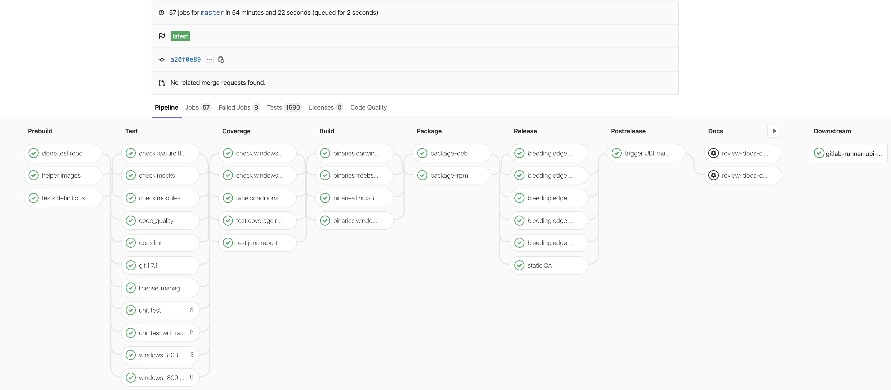

# 晨光科力普基于gitlab-ci/cd持续集成服务的应用

## 简要介绍gitlab-ci/cd在晨光科力普项目中的应用

### 背景介绍

科力普省心购是晨光文具集团在19年初为了拓展综合办公物资采购业务成立的B2B电商平台，面向中小企业客群。省心购项目启动之前，公司其他项目多为企业、政府、事业单位等提供办公用品采购服务，采用定期发版的方式保证系统的稳健运行，一个小的需求也可能要等上一周才会发布。多达五套的运行环境使得我们需要一款能够保证省心购项目顺利快速准确迭代的CI/CD工具。

### 为什么选择gitlab-ci/cd

首先是公司选择了gitlab作为代码仓库，本身包含协调作业的开源持续集成服务`gitlab-ci/cd`，那么`gitlab-ci/cd`自然成了我们首先调研的对象。`gitlab`作为服务的提供者，由`gitlab-runner`注册后依轮询的方式获取服务的指令，执行相应的构建动作,同时将处理进度和结果信息实时返回给gitlab并在项目仓库侧边栏`CI/CD`->`Pipelines`中实时展现出来。`Setting`->`CI/CD`模块下的`Auto DevOps` 自动化DevOps功能、`Variables`变量配置，`Runners`执行者配置提供了强大的公共配置管理功能。在编写完`.gitlab-ci.yml`构建配置文件和`dockerfile`文件即可满足我们的自动化需求。使用了大半年的时间再看，官方对于gitlab和gitlab-ci的迭代速度也是非常快，基本上每个月都会有新特性的加入。

### 分支与环境介绍

|  git分支  | K8S集群 | 运行环境 |             说明             |
|:---------:|:-------:|:--------:|:----------------------------:|
|    dev    |   dev   |   dev    |           开发环境           |
|   test    |  test   |   test   |           测试环境           |
|    uat    |   uat   |   uat    |           验收环境           |
|    prd    |   prd   | pre、prd |       金丝雀和生产环境       |
| feature-* |         |          | 开发分支，按需合并到环境分支 |

//////此处待补充开发测试流程图示

### gitlab-runner与.gitlab-ci.yml介绍

`gilab-runner`提供了多种执行者供我们选择，常见的shell,docker,docker-machine,kubernetes等。基于部署维护和权限方面的考量，我们最终选择了docker作为执行者，为每个团队启动一个runner容器，容器内按分支注册了4个runner分别处理各个分支的CI/CD任务。目前团队已进入并规范化了三个阶段：`compile`编译、`docker-build`镜像构建、`deployment`部署。

一个简单的示例

```yaml
# .gitlab-ci.yml
stages:
  - compile #编译阶段
  - docker-build #镜像构建阶段
  - deployment #部署阶段

compile:
  stage: compile
  image: golang:1.14.2
  script:
      - go build #执行编译命令 go build 或 npm ci 等
  artifacts:
    paths:
      - bin/ #编辑结果保存，可通过gitlab界面下载，主要是为了自动传递给 镜像构建阶段

docker-build:
  stage: docker-build
  image: docker:19.03.8
  services:
    - docker:19.03.8-dind
  script:
    # 执行镜像构建命令，特殊的镜像命名方式同样需要采用 artifacts 传递给 部署阶段
    - docker build -t registry.*.com/clp-dev/project:CI_COMMIT_SHORT_SHA-YYYYMMDDHHmm .

deployment:
  stage: deployment
  image: registry.*.com/kubectl:v1.17.3 # 需要自己构建
  script:
    # 执行部署命令
    - kubectl patch deploy K8S_DEPLOYMENT_NAME -p '更新镜像json字符串'
```


在我们现有的项目中使用的还是比较简单的用法。复杂的情形也是可以轻松应对，参考官方`gitlab-runner`的CI/CD构建流程图


对于各个阶段，`start_in`延时，`timeout`超时控制，`retry`失败重试，`interruptible` 打断旧的构建，`trigger`触发器别的构建，`parallel`阶段并行等操作都是支持的。如果需要安排定点上线还可以使用`CI/CD`->`Schedules`调度器配置构建任务的定时执行。

每个构建阶段都能够能通过系统环境变量拿到很多关于构建任务的信息，

## 多项目CI/CD配置管理

### 遇到的问题

项目初始情况

- A项目基于go语言，`compile`阶段 `image: golang:1.12.8`
- B项目基于nodejs，`compile`阶段 `image：node:v10.8`

随着时间推移

- C项目基于go语言，`compile`阶段 `image: golang:1.13.1`
- D项目...
- E项目...

每个项目下各自维护的CI/CD配置文件给开发和维护带来了极大的不便。首先，新开项目从别的项目中复制一份`.gitlab-ci.yml`文件来用通常是较为简单地做法，但是`docker-build`阶段和`deployment`阶段都是冗余的配置，不符合编程理念。其次，开发语言、容器基础镜像等存在的BUG或升级可能需要我们不得不跟进，
就算只有1个项目，我们也需要创建一个配置升级分支并合并到所有环境分支上，工作量大大增加。再者，CI/CD配置文件维护也是一个持续的过程，gitlab新版本升级带来的新的特性引入、CI/CD阶段完善（编译前增加`test`单元测试阶段，部署后增加验证`check`阶段）等都很难推进实现。

### 如何解决

`gitlab-ci.yml`采用YAML数据格式语言，自然不可缺少对于锚点（&）和引用（*）的支持，在一个文件中可以很方便的将阶段公共配置拆分出来。如果套用面向对象设计的五大基本原则，`gitlab-ci.yml`承担很多太多的职责，所以对于不同阶段我们可以拆分成不同的文件，在需要的时候引用。官方在很早的版本就引入了组合复用，并不断完善使用体验。现在我们可以使用`include`引入`local`当前项目， `file`相同git组织，`template`官方模板和`remote`远程文件（OSS）从不同位置引入1+个配置好的`yaml`文件进行文件复用。并使用`extends`为我们提供细致的配置代码模块复用。

#### 文件组合

```yaml
# 文件复用演示
# 镜像构建阶段文件
# 项目 /common/cicd
# 位置 /prepared-docker-build.yaml
job-docker-build:
  stage: docker-build
  script:
      - docker build -t registry.*.com/mygroup/myproject:CI_COMMIT_SHORT_SHA

# 部署阶段文件
# 项目 /common/cicd
# 位置 /prepared-deployment.yml
job-deployment:
  stage: deployment
  script:
    - kubectl patch deploy K8S_DEPLOYMENT_NAME -p '更新镜像json字符串'

# 引用
# 项目 /yourgroup/yourproject
# 位置 /.gitlab-ci.yml
include:
  - project: "common/cicd"
    ref: "master" #v1 v2 branch
    file: "/prepared-docker-build.yml"
  - project: "common/cicd"
    file: "/prepared-deployment.yml"
```

通过`include`关键字，我们很方便的实现了文件的组合复用。但我们最终的目的是使用`common/cicd`项目实现CI/CD配置文件的完全托管,所以可以采用如下操作：

```yaml
# 项目 /common/cicd
# 位置 /yourgroup/yourproject-ci.yml
include:
  - local: "/prepared-docker-build.yml"
  - local: "/prepared-deployment.yml"

#项目 /yourgroup/yourproject
#位置 /.gitlab-ci.yml
include:
  - project: "common/cicd"
    file: "/yourgroup/yourproject-ci.yml"
```

#### 模块组合

```yaml
#项目 /common/cicd
#位置 /prepared-rule.yml

#通过Merge Request操作合并时，Merge到目标分支前不允许触发构建（此处暂时屏蔽，但它很有用，在真正合并前我们可以做代码规范和是否能运行检测等）
.rule-merge_request_event: &rule-merge_request_event
  if: '$CI_PIPELINE_SOURCE == "merge_request_event"'
  when: never

# 默认规则 如果不是合并动作，再检查是否是 dev 分支，是的话才能执行构建任务。
.rule-default:
  rules:
    - *rule-merge_request_event
    - if: '$CI_COMMIT_REF_NAME == "dev"'
      when: on_success
#

#位置 /stage-tags.yml
#分配给持有dev标签的runner运行
.tags-dev:
  tags:
    - dev

# 位置 /prepared-compile.yaml

# go项目编译动作
job-compile-go:
  extends:
    - .rule-default
    - .tags-dev
  stage: compile
  script:
      - go build .

# node项目编译动作
job-compile-node:
  extends:
    - .rule-default
    - .tags-dev
  stage: compile
  script:
    - npm ci
```

演示中使用`extends`特性，在编译阶段如果不是通过合并事件`merge_request_event`,且需要在`dev`分支上触发的构建才会执行编译动作，实现了规则和标签的复用。甚至是：

```yaml
# 位置 /prepared-compile.yaml
.compile-default:
  stage: compile
  interruptible: true

.compile-script-go:
  script:
    - go build

# 可供引用者重写
.compile-case:
  extends:
    - .compile-default

# 位置 /stage-compile.yaml
job-compile:
  extends:
    - .rule-dev
    - .tags-dev
    - .compile-case

# 位置 /yourgroup/yourproject-ci.yml
.compile-case:
  extends:
    - .compile-default
    - .compile-script-go
  after_script:
    - echo '只为演示可重写'
```

可以暴露出`.compile-case`供具体使用方重写。


### 总结

通过以上示例简单演示了多项目CI/CD配置文件管理的方式，为我们对公司项目构建流程持续完善打好了基础。

- `extends` 支持多级继承，但是不建议使用三个以上级别。支持的最大嵌套级别为10
- `include` 总共允许包含100个，重复包含被视为配置错误
- 尽可能的保证相同语言阶段模块内容一致

## 并发构建处理

合理的缓存配置能够帮助我们减少构建时间，早期采用单实例单线程的方式使得我们无需考虑并发情况的处理。但随着项目的增多，不同项目，不同分支的并发构建需求愈加强烈，驱动着我们不断的对`gitlab-runner`和`ci/cd`配置优化。

### 缓存

#### image services 运行时的镜像

`pull_policy`有三种拉取策略

- always 总是会拉取镜像
- if-not-present 如果本地存在则直接使用本地镜像 不存在则拉取，推荐使用
- never 仅从本地获取镜像

```toml
#config.toml

[[runners]]
  pull_policy = "if-not-present"
```

#### 构建阶段缓存 node_modules vendor

编译阶段，node项目需要执行`npm ci`或`npm i`拉取`node_modules`信息，如果不配置缓存每次都要从源地址拉取，拖慢编译时间，配置之后在下次构建任务触发时会根据我们在`cache->key`定义的关键字寻找是否存在缓存，如果有就被预先加载进来。

```yaml

#方式一
job-compile:
  cache:
      # 字符串不支持路径
      # 自由组合,前提是保证阶段运行时唯一
      # CI_COMMIT_REF_NAME 分支名 CI_PROJECT_NAMESPACE 组名 CI_PROJECT_NAME 项目名
      #例如: dev-mygroup-myproject-node_modules 最终node_modules会被压缩成cache.zip放在此目录下
      key: ${CI_COMMIT_REF_NAME}-${CI_PROJECT_NAMESPACE}-${CI_PROJECT_NAME}-node_modules
      paths:
        - node_modules

#方式二 依赖gitlab 12.5
job-compile:
  cache:
    key:
      files:
        - package.json
      prefix: ${CI_PROJECT_NAMESPACE}-${CI_PROJECT_NAME}-node_modules

## 编译阶段之后的镜像构建和部署阶段
job-deployment:
  cache:
    policy: pull #pull-push
```

- `key` 存放路径
- `paths` 配置当前构建容器中的那些路径需要被缓存起来。
- `policy` 每个job其实阶段都会执行获取缓存和保存缓存动作，单部分阶段，如 镜像构建和部署阶段，并不需要。所以我们可以设置成`pull`仅拉取，加快编译速度。

因目前gitlab版本略低，我们目前采用的是`方式一`的配置方式，每个项目的每个构建环境分支维护一个属于自己的缓存地址。

`方式二`依赖较新的gitlab版本，对`key`进行了扩展。我们更倾向于这种方式，原因是依node项目为例，node_modules文件中的内容是根据`package.json`或`package-lock.json`生成的，如果这两个文件没有发生变化，那么就无需更新缓存信息。

`key`=`prefix`+`-`+`SHA(files)`

- `prefix` 生成目录的前缀，可以不定义
- `files` 判定缓存是否需要更新的文件，最多2个，最终生成的路径是根据这两个文件计算出SHA码

### 并发控制

- git clone 地址处理
- cache key 处理
- 同分支频繁提交取消旧的构建任务

早期项目较少 多个项目多个分支在构建时会按提交顺序依次执行。

```toml
concurrent = 1
[[runners]]
  name = "runner-dev"
  limit = 1
```

改进配置 随着项目的推进，我们基于分支环境拆分了各自独立的runner，每个环境最多只有一个构建任务执行。

```toml
concurrent = 4
[[runners]]
  name = "runner-dev"
  limit = 1
[[runners]]
  name = "runner-test"
  limit = 1
[[runners]]
  name = "runner-uat"
  limit = 1
[[runners]]
  name = "runner-prd"
  limit = 1
```

现在 多个项目多分支支持并发构建。假设A项目的dev分支连续有5次提交，在以往的配置中会触发5个构建任务。第一个在执行，2~5或者B项目dev分支的构建任务需要等待。

```toml
concurrent = 15
[[runners]]
  name = "runner-dev"
  limit = 5
[[runners]]
  name = "runner-test"
  limit = 5
[[runners]]
  name = "runner-uat"
  limit = 5
[[runners]]
  name = "runner-prd"
  limit = 5
```

## 思考与探索

////// 待补充，后续可能增加或删减部分

### trigger

### resource_group

### check 阶段

### Auto DevOps

### CI/CD Dashboard Prometheus
