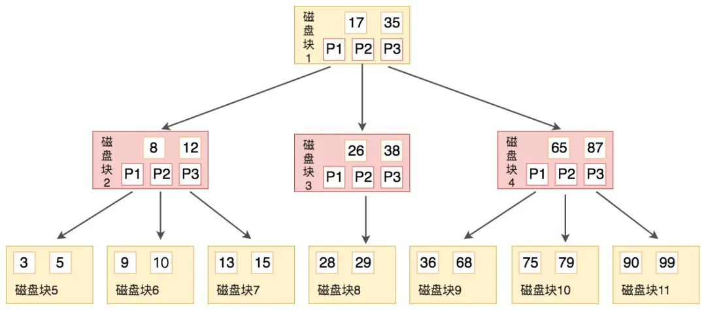
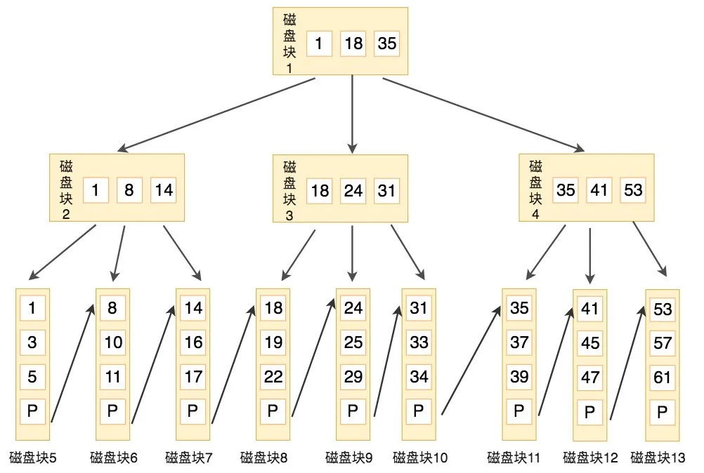
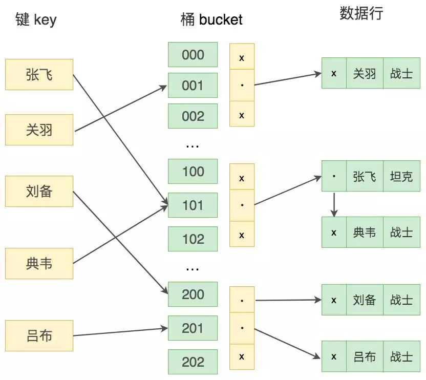
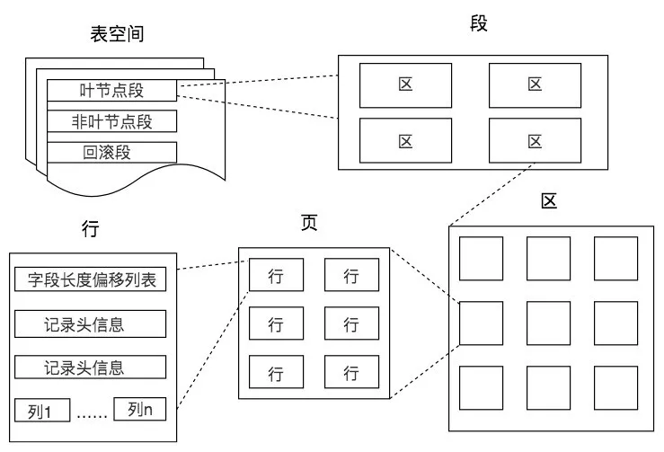
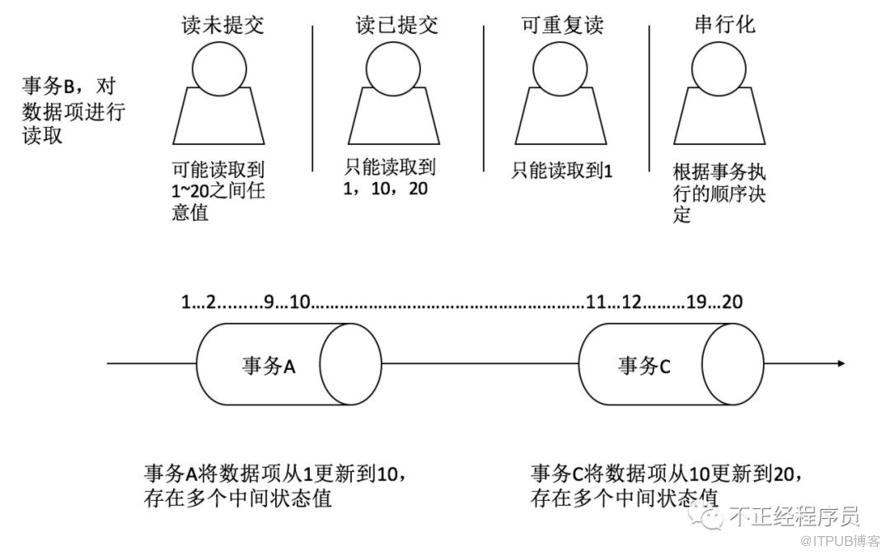
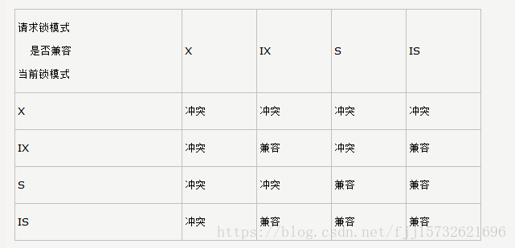

# mysql问题

## 三大范式

- 第一范式 原子性 每列（字段）都是不可分割的原子值
- 第二范式 每列都和主键有关
- 第三范式 每列数据都直接与主键相关

## 索引问题

- 功能逻辑
  - 普通索引
  - 唯一索引 字段唯一
  - 主键索引 NOT NULL+UNIQUE
  - 全文索引 支持但不友好缺少好的分词
- 物理方式
  - 聚集索引：按照主键的维度来排序存储数据，对数据的查询效率高。
    - 叶子节点是数据
  - 非聚集索引：在数据库系统会有单独的存储空间存放非聚集索引，这些索引项是顺序存储的，但索引项指向的内容是随机存储的
    - 叶子节点是数据位置
- 组成方式
  - 单一索引 单字段
  - 组合索引 多字段 最左原则

### 应用问题

- 建索引要求
  - 字段的数值有唯一性的限制
  - 频繁作为 WHERE 、GROUP BY 和 ORDER BY 的列
  - 频繁更新的字段不一定要创建索引，维护成本高
  - 一般主键建议使用默认自增，减少索引结构的分裂和移动
- 导致失效情况
  - 索引进行表达式计算
  - like '%aa%' 前边%号会导致无法使用索引


### 索引结构

- 二叉搜索树(二叉排序树、二叉查找树）
  - 左子节点小于根节点
  - 右子节点大于根节点
  - 极端情况变成 链表 搜索性能下降
- 平衡二叉搜索树（AVL）
  - 基于二叉搜索数限制左子树和右子树高度相差不能大于1
- B树
  - 一个节点可以拥有M个子节点
  - 中间节点可存储K个关键字数据 存在K+1个指针指向下层子节点磁盘块
- B+树
  - 效率稳定：中间节点不存储数据，叶子节点存储数据 首位相连组成有序链表
  - 阶数（子节点数量）更大，深度更低
  - 最左原则
- hash索引
  - 单查效率高
  - 不支持最左原则
  - 不能进行范围查询


### B树



### B+树



### hash



### 存储



### EXPLAIN

- id 嵌套查询拆解 越大的的越先执行
- select_type
  - simple 简单子查询，不包含子查询和union
  - primary 包含union或者子查询，最外层的部分标记为primary
  - subquery 一般子查询中的子查询被标记为subquery，也就是位于select列表中的查询
  - derived 派生表——该临时表是从子查询派生出来的，位于form中的子查询
  - union 位于union中第二个及其以后的子查询被标记为union，第一个就被标记为primary如果是union位于from中则标记为derived
  - union result 用来从匿名临时表里检索结果的select被标记为union result
  - dependent union 顾名思义，首先需要满足UNION的条件，及UNION中第二个以及后面的SELECT语句，同时该语句依赖外部的查询
  - subquery 子查询中第一个SELECT语句
  - dependent subquery 和DEPENDENT UNION相对UNION一样
- table 表明
- partitions
- type
  - all 全表扫描
  - index 走索引
- possible_keys 显示查询使用了哪些索引，表示该索引可以进行高效地查找，但是列出来的索引对于后续优化过程可能是没有用的
- key 显示MySQL实际决定使用的键（索引）。如果没有选择索引，键是NULL。要想强制MySQL使用或忽视possible_keys列中的索引，在查询中使用FORCE INDEX、USE INDEX或者IGNORE INDEX。
- key_len 显示MySQL决定使用的键长度。如果键是NULL，则长度为NULL。使用的索引的长度。在不损失精确性的情况下，长度越短越好 。
- ref 显示使用哪个列或常数与key一起从表中选择行
- rows 显示MySQL认为它执行查询时必须检查的行数。注意这是一个预估值。
- filered
- Extra

## 事务

- 原子性（Atomicity）
  - 事务开始后所有操作，要么全部做完，要么全部不做，不可能停滞在中间环节。事务执行过程中出错，会回滚到事务开始前的状态，所有的操作就像没有发生一样。也就是说事务是一个不可分割的整体，就像化学中学过的原子，是物质构成的基本单位。
- 一致性（Consistency）
  - 事务开始前和结束后，数据库的完整性约束没有被破坏 。比如A向B转账，不可能A扣了钱，B却没收到。
- 隔离性（Isolation）
  - 同一时间，只允许一个事务请求同一数据，不同的事务之间彼此没有任何干扰。比如A正在从一张银行卡中取钱，在A取钱的过程结束前，B不能向这张卡转账。
- 持久性（Durability）
  - 事务完成后，事务对数据库的所有更新将被保存到数据库，不能回滚。

### 并发问题

- 脏读
  - 读取了其他事物未保存的数据，其他事务回滚
- 不可重复读
  - 侧重修改 A事务两次读取中间 B事务修改了相应的结果 导致读取的数据不一致。
- 幻读
  - 侧重新增和删除，A事务在操作Where条件下的数据，B事务同时插入或删除了一条数据并提交，A再次读取时发现结果与期望的不一致。

### 隔离级别

查看方式

```sql
-- 查看数据库默认事务隔离级别 REPEATABLE-READ
SELECT @@transaction_isolation
```

|         事务隔离级别         | 脏读 | 不可重复读 | 幻读 | 加锁方式 |
|:----------------------------:|:----:|:----------:|:----:|----------|
| 读未提交（read-uncommitted） |  是  |     是     |  是  |          |
|  读已提交（read-committed）  |  否  |     是     |  是  |          |
| 可重复读（repeatable-read）  |  否  |     否     |  是  |          |
|    串行化（serializable）    |  否  |     否     |  否  | 读写     |



- 读未提交：别人改数据的事务尚未提交，我在我的事务中也能读到。
- 读已提交：别人改数据的事务已经提交，我在我的事务中才能读到。
- 可重复读：别人改数据的事务已经提交，我在我的事务中也不去读。
- 串行：我的事务尚未提交，别人就别想改数据。

REPEATABLE READ以上会触发 gap锁

## 快照读、当前读

- 快照读
  - select * from table where ?;
- 当前读
  - lock in share mode
  - for update
  - insert update delete

## 锁机制

- 表级锁：操作对象是数据表。MySQL大多数锁策略都支持，开销小，加锁快。不会出现死锁。锁定粒度大，发生锁冲突的概率最高，并发度最低。
- 行级锁：操作对象是数据表中的一行，开销大，加锁慢；会出现死锁；锁定粒度最小，发生所冲突的概率最低，并发度也最高。
- 页面锁：开销和加锁时间界定于表锁和行锁之间；会出现死锁；锁定粒度介于表锁和行锁之间，并发度一般。

- S锁 读锁 共享锁
  - 数据级别
  - select * from table where ? lock in share mode
- X锁 写锁 排它锁
  - 数据级别
  - select * from table where ? for update
  - insert into table values (…)
  - update table set ? where ?
  - delete from table where ?

- IS锁 意向共享锁
  - 表级别
- IX锁 意向排它锁
  - 表级别



### 一些语法

```sql
-- 适用于基于主键或唯一键的新增或修改
INSERT INTO TABLE () ON DUPLICATE KEY UPDATE VALUE(key1),VAULE(key2)

-- 查看获取锁等待超时时间 默认50s
SHOW GLOBAL VARIABLES LIKE 'innodb_lock_wait_timeout';
```


## 相关资料

- [mysql官方文档](https://dev.mysql.com/doc/)
- [Mysql加锁过程详解](https://www.cnblogs.com/crazylqy/p/7611069.html)
- [红黑树](https://www.jianshu.com/p/e136ec79235c)