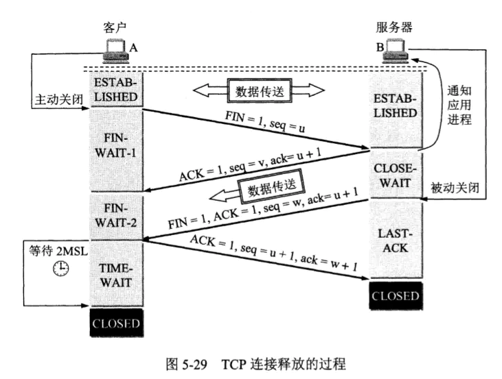

# 网络问题

## 短连接与长连接

- 短连接
  - 建立连接——数据传输——关闭连接...建立连接——数据传输——关闭连接
- 长连接
  - 建立连接——数据传输...（保持连接）...数据传输——关闭连接

## TCP

- ACK Acknowledge character 确认字符
- SYN Synchronousidle character 同步字符
- NAK Negative Acknowledge character 否认字符


- Seq Sequence Number 序列号
- Ack Acknowledgement Number 确认应答号
- Checksum TCP数据段的校验和

- CLOSED 初始关闭状态
- LISTEN 服务端初一监听状态，可以连接了
- SYN_SENT 客户端发起创建连接请求后的状态
- SYN_RECV 接收到客户端连接请求并回应后的服务端状态
- ESTABLISHED 已建立连接状态
- FIN_WAIT_1 向对方发送FIN报文后等待响应的状态
- FIN_WAIT_2 对方响应ACK报文后，自身进入此状态
- TIME_WAIT 表示收到了对方的FIN报文，并发送出了ACK报文，就等2MSL（max segment lifetime）(RFC793定义120s，linux为30s)后即可回到CLOSED可用状态了。如果FIN_WAIT_1状态下，收到了对方同时带FIN标志和ACK标志的报文时，可以直接进入到TIME_WAIT状态，而无须经过FIN_WAIT_2状态。
- CLOSING 双方同时发送FIN报文后，尚未收到对方ACK，但是收到了对方FIN后的状态。说明此次两端都想要关闭了。
- CLOSE_WAIT 接收到对方的FIN报文后，响应了ACK报文，但是此时有尚未发送发的数据，进入此状态。
- LAST_ACK 被动关闭一方在发送FIN报文后，最后等待对方的ACK报文。当收到ACK报文后，也即可以进入到CLOSED可用状态了。

## 三次握手


- 客户端发起 SYN  Seq=i 并进入 SYN_SENT 状态
- 服务端响应 ACK和SYN Ack=i+1 Seq=j 并进入 SYN_RECV 状态
- 客户端响应 ACK Seq=i+1 Ack=j+1 进入 ESTABLISHED 状态

## 握手完毕

确认缓冲区大小

Windows size value 该端缓冲区大小

- 服务端 TCP Window Update Seq=Ack ACK=Seq

## 四次挥手



- 客户端发起 FIN和ACK Seq=i
- 服务端发起 ACK Ack=i+1 Seq=j 客户端
- 服务端发起 FIN和ACK Ack=i+1 Seq=j
- 客户端发起 ACK Ack=j+1 Seq=j

## 常见问题

```shell
# 查看各阶段状态
netstat -n | awk '/^tcp/ {++S[$NF]} END {for(a in S) print a, S[a]}'
```

### 客户端大量TIME_OUT


高并发时大量短连接未关闭导致的

- go中 http.Transport设置KeepAlive 默认的是30秒

```golang
http.Client{
    Timeout: 5 * time.Second,
    Transport: &http.Transport{
        Proxy: http.ProxyFromEnvironment,
        DialContext: (&net.Dialer{
            Timeout:   1 * time.Second,
            KeepAlive: 30 * time.Second,
            DualStack: true,
        }).DialContext,
        MaxIdleConns:        100,
        MaxIdleConnsPerHost: 8,
        IdleConnTimeout:     120 * time.Second,
    },
}
```

## DNS

/etc/resolv.conf 中配置多个nameserver需要配置options

- rotate 轮询
- timeout 1 超时
- attempts 3 重试


## 相关资料

- [CLOSE_WAIT、CLOSE_WAIT原因，危害，如何避免](https://www.cnblogs.com/liuhongru/p/11011891.html)

```conf
# cat sysctl.conf
# 重启 sysctl -p
net.core.netdev_max_backlog = 400000
#该参数决定了，网络设备接收数据包的速率比内核处理这些包的速率快时，允许送到队列的数据包的最大数目。

net.core.optmem_max = 10000000
#该参数指定了每个套接字所允许的最大缓冲区的大小

net.core.rmem_default = 10000000
#指定了接收套接字缓冲区大小的缺省值（以字节为单位）。

net.core.rmem_max = 10000000
#指定了接收套接字缓冲区大小的最大值（以字节为单位）。

net.core.somaxconn = 100000
#Linux kernel参数，表示socket监听的backlog(监听队列)上限

net.core.wmem_default = 11059200
#定义默认的发送窗口大小；对于更大的 BDP 来说，这个大小也应该更大。

net.core.wmem_max = 11059200
#定义发送窗口的最大大小；对于更大的 BDP 来说，这个大小也应该更大。

net.ipv4.conf.all.rp_filter = 1
net.ipv4.conf.default.rp_filter = 1
#严谨模式 1 (推荐)
#松散模式 0

net.ipv4.tcp_congestion_control = bic
#默认推荐设置是 htcp

net.ipv4.tcp_window_scaling = 0
#关闭tcp_window_scaling
#启用 RFC 1323 定义的 window scaling；要支持超过 64KB 的窗口，必须启用该值。

net.ipv4.tcp_ecn = 0
#把TCP的直接拥塞通告(tcp_ecn)关掉

net.ipv4.tcp_sack = 1
#关闭tcp_sack
#启用有选择的应答（Selective Acknowledgment），
#这可以通过有选择地应答乱序接收到的报文来提高性能（这样可以让发送者只发送丢失的报文段）；
#（对于广域网通信来说）这个选项应该启用，但是这会增加对 CPU 的占用。

net.ipv4.tcp_max_tw_buckets = 10000
#表示系统同时保持TIME_WAIT套接字的最大数量

net.ipv4.tcp_max_syn_backlog = 8192
#表示SYN队列长度，默认1024，改成8192，可以容纳更多等待连接的网络连接数。

net.ipv4.tcp_syncookies = 1
#表示开启SYN Cookies。当出现SYN等待队列溢出时，启用cookies来处理，可防范少量SYN攻击，默认为0，表示关闭；

net.ipv4.tcp_timestamps = 1
#开启TCP时间戳
#以一种比重发超时更精确的方法（请参阅 RFC 1323）来启用对 RTT 的计算；为了实现更好的性能应该启用这个选项。

net.ipv4.tcp_tw_reuse = 1
#表示开启重用。允许将TIME-WAIT sockets重新用于新的TCP连接，默认为0，表示关闭；

net.ipv4.tcp_tw_recycle = 1
#表示开启TCP连接中TIME-WAIT sockets的快速回收，默认为0，表示关闭。

net.ipv4.tcp_fin_timeout = 10
#表示如果套接字由本端要求关闭，这个参数决定了它保持在FIN-WAIT-2状态的时间。

net.ipv4.tcp_keepalive_time = 1800
#表示当keepalive起用的时候，TCP发送keepalive消息的频度。缺省是2小时，改为30分钟。

net.ipv4.tcp_keepalive_probes = 3
#如果对方不予应答，探测包的发送次数

net.ipv4.tcp_keepalive_intvl = 15
#keepalive探测包的发送间隔

net.ipv4.tcp_mem
#确定 TCP 栈应该如何反映内存使用；每个值的单位都是内存页（通常是 4KB）。
#第一个值是内存使用的下限。
#第二个值是内存压力模式开始对缓冲区使用应用压力的上限。
#第三个值是内存上限。在这个层次上可以将报文丢弃，从而减少对内存的使用。对于较大的 BDP 可以增大这些值（但是要记住，其单位是内存页，而不是字节）。

net.ipv4.tcp_rmem
#与 tcp_wmem 类似，不过它表示的是为自动调优所使用的接收缓冲区的值。

net.ipv4.tcp_wmem = 30000000 30000000 30000000
#为自动调优定义每个 socket 使用的内存。
#第一个值是为 socket 的发送缓冲区分配的最少字节数。
#第二个值是默认值（该值会被 wmem_default 覆盖），缓冲区在系统负载不重的情况下可以增长到这个值。
#第三个值是发送缓冲区空间的最大字节数（该值会被 wmem_max 覆盖）。

net.ipv4.ip_local_port_range = 1024 65000
#表示用于向外连接的端口范围。缺省情况下很小：32768到61000，改为1024到65000。

net.ipv4.netfilter.ip_conntrack_max=204800
#设置系统对最大跟踪的TCP连接数的限制

net.ipv4.tcp_slow_start_after_idle = 0
#关闭tcp的连接传输的慢启动，即先休止一段时间，再初始化拥塞窗口。

net.ipv4.route.gc_timeout = 100
#路由缓存刷新频率，当一个路由失败后多长时间跳到另一个路由，默认是300。

net.ipv4.tcp_syn_retries = 1
#在内核放弃建立连接之前发送SYN包的数量。

net.ipv4.icmp_echo_ignore_broadcasts = 1
# 避免放大攻击

net.ipv4.icmp_ignore_bogus_error_responses = 1
# 开启恶意icmp错误消息保护

net.inet.udp.checksum=1
#防止不正确的udp包的攻击

net.ipv4.conf.default.accept_source_route = 0
#是否接受含有源路由信息的ip包。参数值为布尔值，1表示接受，0表示不接受。
#在充当网关的linux主机上缺省值为1，在一般的linux主机上缺省值为0。
#从安全性角度出发，建议你关闭该功能。
```